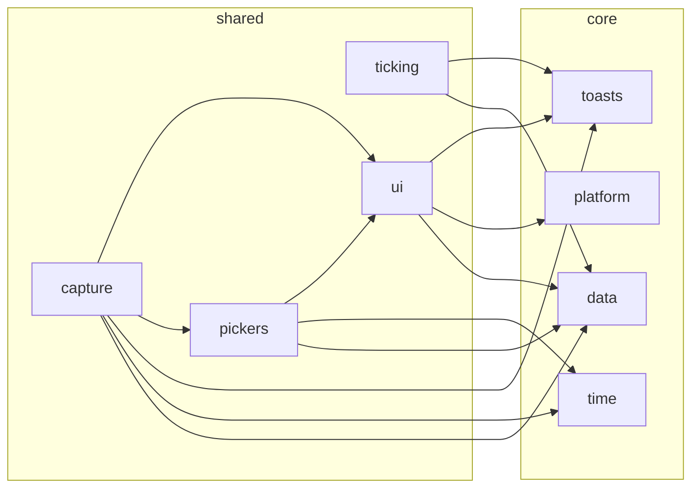

# Shared to core

What the modules in `shared` import from each other and from `core`. Generated from the real imports by `npm run diagrams` in `app/`; don't edit by hand.

```mermaid
flowchart LR
  subgraph shared["shared"]
    shared_capture["capture"]
    shared_pickers["pickers"]
    shared_ticking["ticking"]
    shared_ui["ui"]
  end
  subgraph core["core"]
    core_data["data"]
    core_platform["platform"]
    core_time["time"]
    core_toasts["toasts"]
  end
  shared_capture --> core_data
  shared_capture --> core_time
  shared_capture --> core_toasts
  shared_capture --> shared_pickers
  shared_capture --> shared_ui
  shared_pickers --> core_data
  shared_pickers --> core_time
  shared_pickers --> shared_ui
  shared_ticking --> core_data
  shared_ticking --> core_toasts
  shared_ui --> core_data
  shared_ui --> core_platform
  shared_ui --> core_toasts
```

